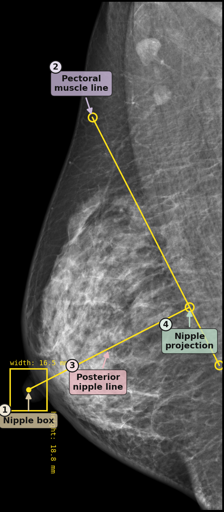
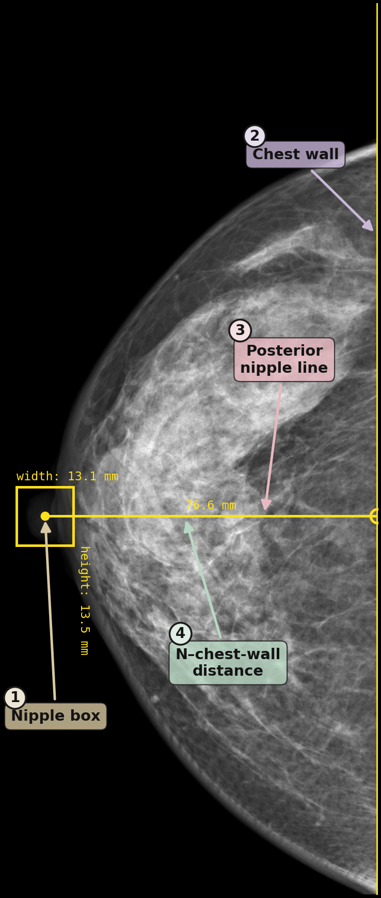

# Mammography Positioning Landmark Labels

Anatomical landmark annotations for **automated mammography positioning quality
assessment** based on the **Posterior Nipple Line (PNL)** criterion. Labels cover
both standard screening views — **MLO** (mediolateral oblique) and **CC**
(craniocaudal) — and are released to support reproducibility of the accompanying
study.

---

## Definition of Findings

| Label | Explanation |
|-------|-------------|
| **Nipple Bounding Box** | A bounding box surrounding the nipple region (annotated on both MLO and CC views). |
| **Pectoralis Muscle Line** | A line delineating the pectoralis muscle, drawn from its inferior end on **MLO** views. Its two vertices serve as the superior and inferior pectoral endpoints. |
| **Posterior Nipple Line (PNL)** | A line perpendicular to the posterior reference, originating from the centre of the nipple bounding box. On MLO the reference is the pectoralis line; on CC it is the chest-wall edge. |
| **Qualitative Quality Label** | An image-level positioning-quality label assigned by an expert radiologist (`Good` / `Bad`). |

> **Note:** PNL coordinates are **not stored directly**. The PNL is derived
> automatically by applying a 90° perpendicular rule from the nipple coordinate to
> the posterior reference, ensuring geometric consistency across all samples.

---

## Dataset

Labels were created on **1,463 MLO–CC image pairs** drawn from **827 studies** of
the publicly available **VinDr-Mammo** dataset. VinDr-Mammo contains 5,000
full-field digital mammography exams collected from opportunistic screening in two
Vietnamese hospitals between 2018 and 2020. External validation in the accompanying
study additionally uses the publicly available **Chinese Mammography Database
(CMMD)**; CMMD images are **not** redistributed here.

### View and split distribution

| View | File | Annotations | Images | Train | Val | Test |
|------|------|-------------|-------:|------:|----:|----:|
| MLO | `mlo_labels.csv` | Nipple bbox + Pectoralis line | 1,463 | 1,186 | 131 | 146 |
| CC  | `cc_labels.csv`  | Nipple bbox                   | 1,463 | 1,186 | 131 | 146 |

Laterality breakdown — MLO: 740 L-MLO / 723 R-MLO; CC: 740 L-CC / 723 R-CC.

---

## Quantitative Labels (`data` column)

Landmark annotations (nipple bounding box on both views, pectoral muscle line on
MLO) were performed by a **single board-certified breast radiologist
(>5 years of breast-imaging experience)** using a browser-based DICOM annotation
tool on a diagnostic-grade monitor, reviewing all images in DICOM format.
Annotations followed ACR and RANZCR positioning guidelines and include:

- The nipple location (bounding box) — MLO and CC.
- The pectoralis muscle line from its inferior end — MLO only.

The chest-wall reference used for the CC PNL is recovered from the image boundary
after laterality-aware cropping rather than being annotated manually.

## Qualitative Labels (`qualitativeLabel` column)

An image-level positioning-quality label (`Good` / `Bad`; paper terminology:
*good* / *poor*) was assigned by an expert radiologist based on holistic ACR
quality standards. Because a valid MLO pectoral reference is required for PNL
geometry, only studies whose **MLO** positioning was rated *Good* were included;
consequently every row in `mlo_labels.csv` carries `Good`, while `cc_labels.csv`
contains the full quality assessment (`Good`: 1,177, `Bad`: 286).

---

## Annotation Example

The figures below illustrate the annotation structure on both views: the nipple
bounding box, the pectoralis muscle line (MLO), the chest-wall reference (CC), and
the automatically derived PNL.

| MLO view | CC view |
|:--------:|:-------:|
|  |  |

---

## CSV Column Descriptions

Both `mlo_labels.csv` and `cc_labels.csv` share the same schema:

| Column | Description |
|--------|-------------|
| `StudyInstanceUID` | Unique identifier for the study (exam). |
| `SOPInstanceUID` | Unique identifier for the image instance within an exam. |
| `annotationMode` | Annotation type: `line` (pectoralis), `bbox` / `bounding_box` (nipple). |
| `labelName` | Label name: `Pectoralis` or `Nipple`. |
| `data` | Geometry: `{'vertices': [[x1,y1],[x2,y2]]}` for lines, `{'x','y','width','height'}` for boxes (pixel coordinates). |
| `qualitativeLabel` | Image-level quality label from the expert radiologist; `Good` or `Bad`. |
| `height` | Image height in pixels. |
| `width` | Image width in pixels. |
| `SeriesDescription` | Imaging view (e.g., `L-MLO`, `R-MLO`, `L-CC`, `R-CC`). |
| `ImagerPixelSpacing` | Physical pixel spacing (mm/pixel). |
| `SeriesInstanceUID` | Unique identifier for the image series. |
| `ManufacturerModelName` | Manufacturer and model name of the imaging device. |
| `PhotometricInterpretation` | Photometric interpretation (e.g., `MONOCHROME1`, `MONOCHROME2`). |
| `Split` | Dataset partition: `Train`, `Validation`, or `Test`. |

---

*The original DICOM pixel data are governed by the VinDr-Mammo data-use agreement
and are not redistributed here; only the author-created landmark annotations
(keyed by the original DICOM UIDs) are provided.*
